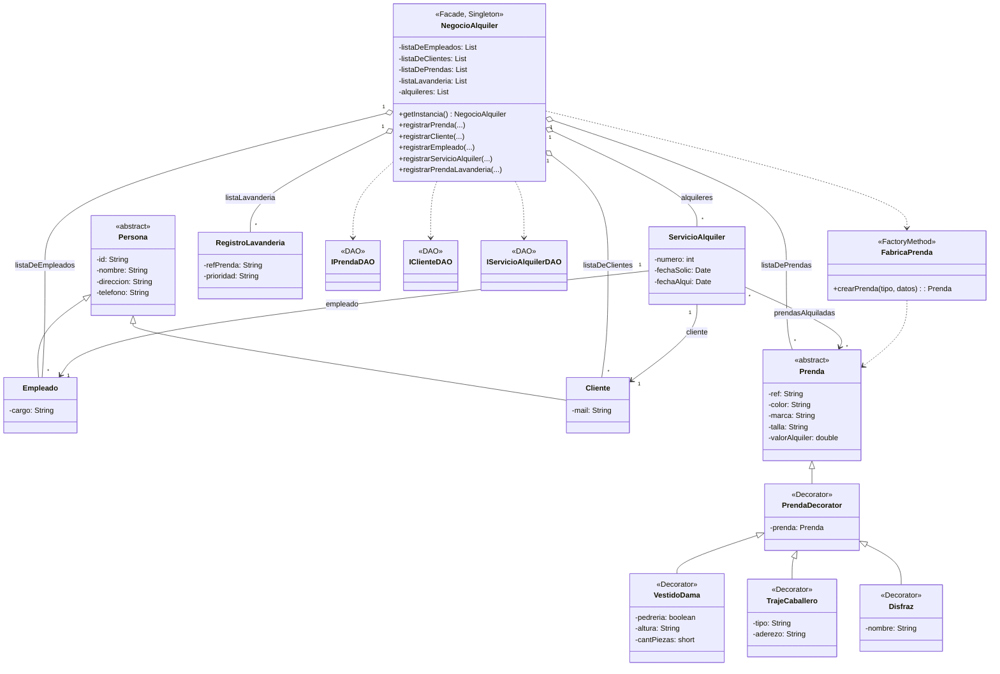
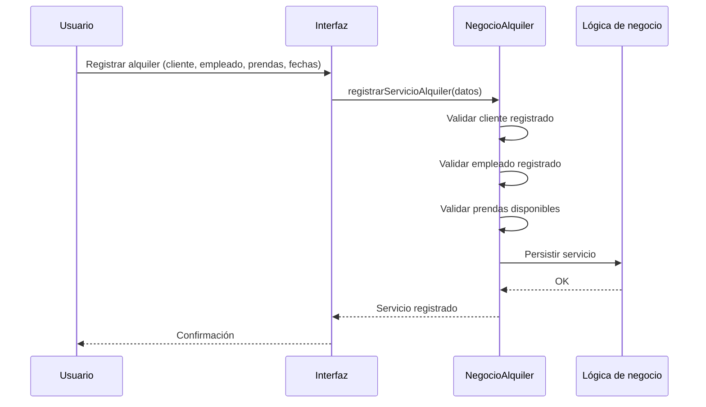
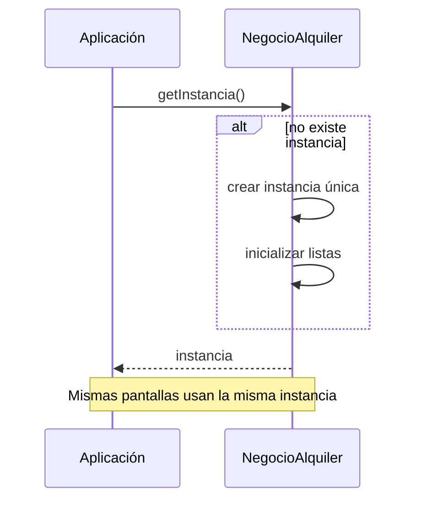
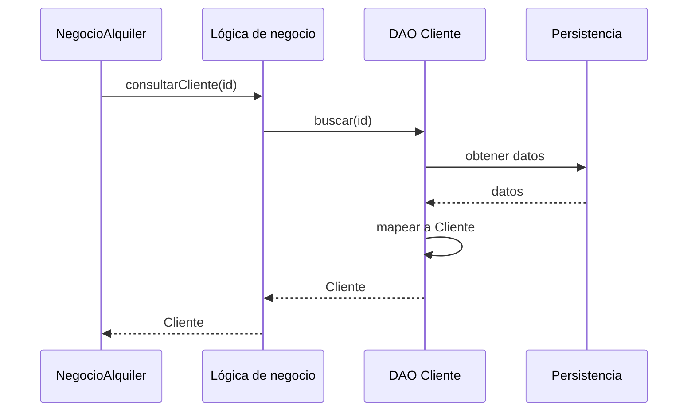
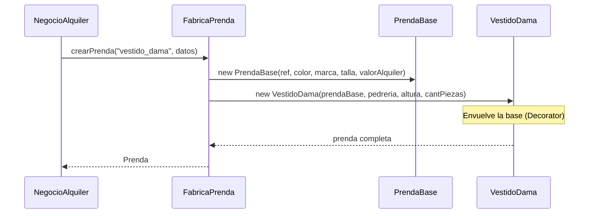
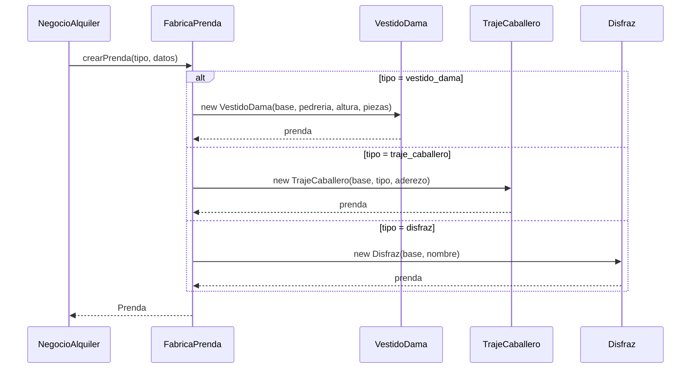
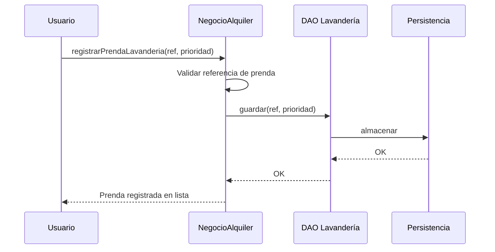

# Los Atuendos — Sistema de Gestión de Alquiler de Vestuario

Sistema de escritorio en Java para la gestión de inventario, clientes, alquileres y lavandería de un negocio de alquiler de vestuario (vestidos, trajes, disfraces).

---

## Tabla de contenidos

1. [Descripción general](#descripción-general)
2. [Requisitos y ejecución](#requisitos-y-ejecución)
3. [Arquitectura y capas](#arquitectura-y-capas)
4. [Patrones de diseño utilizados](#patrones-de-diseño-utilizados)
5. [Modelos (entidades)](#modelos-entidades)
6. [DAO (Data Access Object)](#dao-data-access-object)
7. [Servicios](#servicios)
8. [Flujos por funcionalidad](#flujos-por-funcionalidad)
9. [Vistas (UI)](#vistas-ui)
10. [Base de datos](#base-de-datos)

---

## Descripción general

**Los Atuendos** permite:

- **Inventario**: Alta de prendas (vestidos de dama, trajes de caballero, disfraces), listado, filtros y consulta de disponibilidad.
- **Clientes**: Registro de clientes y consulta por ID con historial de alquileres.
- **Alquileres**: Registro de alquileres (varias prendas por cliente), fechas de solicitud y entrega.
- **Lavandería**: Registro de prendas enviadas a lavandería con prioridad y observaciones.

La interfaz es una aplicación de escritorio con **Java Swing**; la persistencia se realiza en **PostgreSQL** (Supabase). Toda la interacción entre la UI y la lógica de negocio pasa por un **Facade** y por **servicios** que utilizan **DAOs** para acceder a la base de datos.

---

## Requisitos y ejecución

- **Java**: 25 (configurado en `pom.xml`)
- **Maven**: para compilar y ejecutar
- **PostgreSQL**: base en Supabase (configuración en `database.DatabaseConfig`)


La aplicación inicia en la pantalla de **Login**. Tras autenticarse con correo y contraseña de un empleado registrado, se accede al **Dashboard** desde donde se gestionan las cuatro funcionalidades.

---

## Arquitectura y capas

```
┌─────────────────────────────────────────────────────────────────┐
│  VISTA (Swing)                                                   │
│  Login · Dashboard · RegistroEmpleados                           │
└───────────────────────────────┬─────────────────────────────────┘
                                │
                                ▼
┌─────────────────────────────────────────────────────────────────┐
│  FACHADA (SistemaFacade) — Singleton                             │
│  Punto único de entrada para la UI                               │
└───────────────────────────────┬─────────────────────────────────┘
                                │
                                ▼
┌─────────────────────────────────────────────────────────────────┐
│  SERVICIOS (lógica de negocio, transacciones)                    │
│  PrendasService · ClienteService · EmpleadoService ·             │
│  ServicioAlquilerService · LavanderiaService (+ servicios        │
│  específicos de prendas: VestidoDamaService, etc.)                │
└───────────────────────────────┬─────────────────────────────────┘
                                │
                                ▼
┌─────────────────────────────────────────────────────────────────┐
│  DAO (acceso a datos)                                            │
│  PrendaDAO · ClienteDAO · EmpleadoDAO · ServicioAlquilerDAO ·    │
│  LavanderiaDAO · VestidoDamaDAO · TrajeCaballeroDAO · DisfrazDAO │
└───────────────────────────────┬─────────────────────────────────┘
                                │
                                ▼
┌─────────────────────────────────────────────────────────────────┐
│  BASE DE DATOS (PostgreSQL / Supabase)                           │
└─────────────────────────────────────────────────────────────────┘
```

La **Vista** solo conoce al **Facade**. Los **Servicios** orquestan transacciones y delegan en los **DAOs**. Los **DAOs** ejecutan SQL y mapean resultados a **Modelos**.

---

## Patrones de diseño utilizados

Este proyecto se centra en la aplicación de patrones de diseño. A continuación se describen los utilizados, su **tipo** (según catálogo GoF y patrones de arquitectura) y su **uso en el sistema**.

---

### 1. Facade (Fachada)

- **Tipo**: Patrón estructural (GoF).
- **Ubicación**: `SistemaFacade.SistemaFacade`.

**Descripción**: Proporciona una interfaz unificada y simplificada a un conjunto de interfaces (en este caso, todos los servicios). La capa de presentación no conoce `PrendasService`, `ClienteService`, etc.; solo llama métodos del Facade.

**En el proyecto**:

- La UI invoca métodos como `facade.insertarNuevoVestido(...)`, `facade.login(...)`, `facade.nuevoServicioAlquiler(...)`, `facade.insertarNuevaLavanderia(...)`.
- El Facade crea los objetos de dominio (por ejemplo `PrendaBase` + decoradores), llama al servicio correspondiente y adapta resultados a la vista (por ejemplo llenar `JTable`).
- Así se reduce el acoplamiento y se centraliza el punto de acceso a la lógica de negocio.

---

### 2. Singleton (Objeto único)

- **Tipo**: Patrón creacional (GoF).
- **Ubicación**: `SistemaFacade.getInstancia()` y conexión en `SupabaseConnection`.

**Descripción**: Garantiza que una clase tenga una única instancia y un punto de acceso global a ella.

**En el proyecto**:

- **SistemaFacade**: `getInstancia()` crea la instancia solo la primera vez; el resto de la aplicación reutiliza la misma. Así se mantiene un único estado de sesión (empleado logueado) y un único conjunto de servicios.
- **SupabaseConnection**: La conexión a la base de datos se reutiliza (variable estática `connection`), evitando abrir una nueva conexión por operación.

---

### 3. DAO (Data Access Object)

- **Tipo**: Patrón de persistencia / arquitectura.
- **Ubicación**: Paquete `DAO`: `PrendaDAO`, `ClienteDAO`, `EmpleadoDAO`, `ServicioAlquilerDAO`, `LavanderiaDAO`, `VestidoDamaDAO`, `TrajeCaballeroDAO`, `DisfrazDAO`.

**Descripción**: Separa la lógica de acceso a datos de la lógica de negocio. Cada DAO encapsula las operaciones CRUD (o las necesarias) sobre una entidad/tabla y recibe la `Connection` desde fuera (el servicio gestiona la transacción).

**En el proyecto**:

- Los **Servicios** obtienen la conexión, inician transacciones (`setAutoCommit(false)`), llaman a los DAOs y hacen `commit` o `rollback`.
- Los DAOs solo ejecutan SQL y mapean `ResultSet` a objetos del modelo. No conocen reglas de negocio ni la UI.
- Ejemplo: `ClienteDAO.insertar(conn, cliente)`, `PrendaDAO.listarTodas(conn)`, `ServicioAlquilerDAO.filtrar(conn, desde, hasta, idCliente, idServicio)`.

---

### 4. Decorator (Decorador)

- **Tipo**: Patrón estructural (GoF).
- **Ubicación**: `model.Prenda` (interfaz), `PrendaBase`, `PrendaDecorator`, `VestidoDama`, `TrajeCaballero`, `Disfraz`.

**Descripción**: Permite añadir responsabilidades (o atributos) a un objeto de forma dinámica. Se define un componente base y decoradores que envuelven al componente y añaden comportamiento o datos extra.

**En el proyecto**:

- **Componente**: `Prenda` (interfaz) con métodos comunes: `getRef()`, `getColor()`, `getMarca()`, `getTalla()`, `getValorAlquiler()`, `getTipo()`.
- **Componente concreto**: `PrendaBase` implementa `Prenda` con los datos de la tabla `prendas` (ref, color, marca, talla, valor_alquiler, tipo).
- **Decorador abstracto**: `PrendaDecorator` implementa `Prenda` y mantiene una referencia a otra `Prenda`; delega en ella todos los getters.
- **Decoradores concretos**:
  - **VestidoDama**: añade `pedreria`, `altura`, `cantPiezas`.
  - **TrajeCaballero**: añade `tipoTraje`, `aderezo`.
  - **Disfraz**: añade `nombre`.

Así se modelan los tres tipos de prenda sin duplicar los atributos comunes y permitiendo tratar todas como `Prenda` en listados y filtros.

---

### 5. Factory Method (Método fábrica)

- **Tipo**: Patrón creacional (GoF).
- **Ubicación**: `PrendasService.construirPrendaCompleta(Connection conn, Prenda base)`.

**Descripción**: Un método que crea objetos sin que el cliente especifique la clase concreta. La decisión de qué clase instanciar se toma dentro del método según algún criterio (aquí, el tipo de prenda).

**En el proyecto**:

- `PrendaDAO` devuelve `PrendaBase` (solo datos de tabla `prendas`).
- Para obtener la prenda “completa” (con atributos de vestido, traje o disfraz), `PrendasService` usa `construirPrendaCompleta(conn, base)`:
  - Si `base.getTipo()` es `"vestido_dama"` → llama a `vestidoService.buscarPorRef(conn, base.getRef())` y devuelve un `VestidoDama`.
  - Si es `"traje_caballero"` → `trajeService.buscarPorRef(...)` → `TrajeCaballero`.
  - Si es `"disfraz"` → `disfrazService.buscarPorRef(...)` → `Disfraz`.
- El resto del código trabaja con `Prenda` sin saber si es vestido, traje o disfraz; la “construcción” concreta queda encapsulada en el servicio.

---

### 6. Capas Servicio + DAO (arquitectura en capas)

- **Tipo**: Patrón de arquitectura (no es un patrón GoF con nombre propio; a veces se asocia a “layered architecture” o “transaction script” con separación de responsabilidades).

**Descripción**: La lógica de negocio (transacciones, validaciones, orquestación) vive en **Servicios**; el acceso a base de datos, en **DAOs**. Los servicios no escriben SQL; los DAOs no conocen reglas de negocio.

**En el proyecto**:

- Servicios abren conexión, controlan `commit`/`rollback`, validan y llaman a uno o varios DAOs (por ejemplo, en inventario: `PrendaDAO` + `VestidoDamaDAO`/`TrajeCaballeroDAO`/`DisfrazDAO`).
- DAOs solo reciben `Connection` y entidades (o parámetros), ejecutan sentencias y devuelven entidades o listas. Esto facilita pruebas y cambios de base de datos.

---

### Resumen de patrones

| Patrón        | Tipo        | Clase / elemento principal                          |
|---------------|------------|-----------------------------------------------------|
| Facade        | Estructural | `SistemaFacade`                                     |
| Singleton     | Creador     | `SistemaFacade.getInstancia()`, `SupabaseConnection`|
| DAO           | Persistencia| Todos los `*DAO` en el paquete `DAO`                |
| Decorator     | Estructural | `Prenda` → `PrendaBase` → `PrendaDecorator` → VestidoDama, TrajeCaballero, Disfraz |
| Factory Method| Creador     | `PrendasService.construirPrendaCompleta(...)`       |
| Capas         | Arquitectura| Servicios + DAOs + Modelos                          |

---

## Modelos (entidades)

Representan las entidades del dominio y la persistencia. No contienen lógica de acceso a datos.

| Modelo           | Descripción                                                                 | Atributos principales                                                                 |
|------------------|-----------------------------------------------------------------------------|----------------------------------------------------------------------------------------|
| **Persona**      | Clase abstracta base para personas con datos de contacto y ubicación.     | id, nombre, direccion, telefono, correo                                                |
| **Empleado**     | Extiende `Persona`. Usado en login y en registro de alquileres.            | cargo, password                                                                        |
| **Cliente**      | Extiende `Persona`. Receptor de alquileres.                                | (hereda de Persona)                                                                   |
| **Prenda**       | Interfaz contrato para toda prenda (patrón Decorator).                     | getRef(), getColor(), getMarca(), getTalla(), getValorAlquiler(), getTipo()             |
| **PrendaBase**   | Implementación base de `Prenda`; datos de la tabla `prendas`.              | ref, color, marca, talla, valorAlquiler, tipo                                          |
| **PrendaDecorator** | Decorador abstracto; envuelve una `Prenda` y delega.                    | prenda (referencia)                                                                    |
| **VestidoDama**  | Decorador concreto: vestidos de dama.                                     | pedreria, altura, cantPiezas                                                            |
| **TrajeCaballero** | Decorador concreto: trajes de caballero.                                 | tipoTraje, aderezo                                                                     |
| **Disfraz**      | Decorador concreto: disfraces.                                             | nombre                                                                                 |
| **ServicioAlquiler** | Un registro de alquiler (una prenda en un servicio en una fecha).        | id, fechaSolicitud, fechaAlquiler, idEmpleado, idCliente, refPrenda                     |
| **Lavanderia**   | Registro de una prenda enviada a lavandería.                              | id, refPrenda, prioridad, observacion                                                  |

---

## DAO (Data Access Object)

Cada DAO trabaja sobre una tabla (o tablas relacionadas) y expone operaciones que reciben `Connection` para que el servicio controle la transacción.

| DAO                  | Tabla(s) / uso principal                    | Operaciones principales                                                                 |
|----------------------|---------------------------------------------|-----------------------------------------------------------------------------------------|
| **PrendaDAO**        | `prendas`                                   | insertar, buscarPorRef, listarTodas, listarTodasDisponibles(refsExcluir), buscarTalla, filtrar(ref,talla,tipo), eliminar, contar |
| **VestidoDamaDAO**   | `vestidos_dama` (por ref)                    | insertar, buscarPorRef, listarTodos                                                     |
| **TrajeCaballeroDAO**| `trajes_caballero`                           | insertar, buscarPorRef, listarTodos                                                     |
| **DisfrazDAO**       | `disfraces`                                 | insertar, buscarPorRef, listarTodos                                                     |
| **ClienteDAO**       | `clientes`                                  | insertar, buscarPorId                                                                   |
| **EmpleadoDAO**      | `empleados`                                 | insertar, buscarPorId, buscarPorCorreoYPassword (login), eliminar                      |
| **ServicioAlquilerDAO** | `servicio_alquiler`                      | insertar, buscarPorIdCliente, listarTodas, buscarRefAlquiladas, buscarPorRef, filtrar(desde,hasta,idCliente,idServicio), eliminar |
| **LavanderiaDAO**    | `lavanderia`                                | insertar, listarTodas                                                                   |

---

## Servicios

Encapsulan la lógica de negocio, transacciones y orquestación de varios DAOs. La UI no los usa directamente; accede a ellos a través del **SistemaFacade**.

| Servicio                 | Responsabilidad principal                                                                 | DAOs / servicios que usa                                      |
|--------------------------|---------------------------------------------------------------------------------------------|---------------------------------------------------------------|
| **PrendasService**      | Listar/buscar/filtrar prendas “completas” (con decorador), insertar y eliminar.            | PrendaDAO, VestidoDamaService, TrajeCaballeroService, DisfrazService |
| **VestidoDamaService**   | Insertar y buscar vestidos (base + tabla vestidos_dama).                                   | PrendaDAO, VestidoDamaDAO                                     |
| **TrajeCaballeroService**| Igual para trajes.                                                                          | PrendaDAO, TrajeCaballeroDAO                                 |
| **DisfrazService**       | Igual para disfraces.                                                                      | PrendaDAO, DisfrazDAO                                        |
| **ClienteService**       | Insertar cliente y buscar por ID.                                                           | ClienteDAO                                                    |
| **EmpleadoService**      | Insertar empleado, buscar por ID, login (correo + password).                               | EmpleadoDAO                                                   |
| **ServicioAlquilerService** | Insertar uno o varios alquileres, listar, buscar por cliente/ref, filtrar, eliminar.    | ServicioAlquilerDAO                                           |
| **LavanderiaService**    | Insertar registro de lavandería y listar todos.                                            | LavanderiaDAO                                                 |

---

## Flujos por funcionalidad

Se describen los cuatro flujos: **Inventario**, **Clientes**, **Alquileres** y **Lavandería**, desde la vista hasta la base de datos.

---

### 1. Inventario (Prendas)

**Objetivo**: Dar de alta prendas (vestido de dama, traje de caballero o disfraz), listarlas, filtrarlas y consultar disponibilidad (excluyendo las ya alquiladas).

**Flujo de alta de prenda**:

1. **Vista (Dashboard)**: El usuario elige tipo (vestido_dama / traje_caballero / disfraz), rellena campos comunes (ref, color, marca, talla, valor alquiler) y los específicos (pedrería/altura/piezas, tipo traje/aderezo, nombre disfraz) y pulsa guardar.
2. **Facade**: `insertarNuevoVestido(ref, color, marca, talla, valorAlquiler, tipo, datos)`.
   - Crea `PrendaBase` con los datos comunes.
   - Según `tipo`, crea el decorador concreto (`VestidoDama`, `TrajeCaballero` o `Disfraz`) envolviendo la base.
   - Llama a `prendasService.insertar(prenda)`.
3. **PrendasService**: 
   - Abre conexión, `setAutoCommit(false)`.
   - Inserta en `prendas` vía `PrendaDAO.insertar(conn, prenda)`.
   - Inserta en la tabla específica (`vestidos_dama`, `trajes_caballero` o `disfraces`) usando el servicio correspondiente (`VestidoDamaService`, etc.).
   - Si todo va bien: `commit`; si no: `rollback`.
4. **DAOs**: `PrendaDAO` inserta una fila en `prendas`; `VestidoDamaDAO`/`TrajeCaballeroDAO`/`DisfrazDAO` insertan la fila con la misma `ref` en su tabla.

**Flujo de listado / filtrado**:

1. **Vista**: Solicita tabla de inventario (todas, por talla o con filtro ref/talla/tipo) o tabla de “prendas disponibles” para alquiler.
2. **Facade**: Métodos como `obtenerModeloTablaPrendas(tabla)`, `obtenerPrendasDisponibles(tabla)`, `filtrarTablaPrendas(tabla, filtro)`, `filtroCompletoPrendas(tabla, ref, talla, tipo)`.
3. **PrendasService**: 
   - Para “disponibles”, primero obtiene referencias alquiladas: `servicioAlquilerService.buscarRefAlquiladas()`.
   - Llama a `PrendaDAO.listarTodas(conn)` o `listarTodasDisponibles(conn, refsExcluir)` o `filtrar(conn, ref, talla, tipo)` o `buscarTalla(conn, talla)`.
   - Para cada `PrendaBase` devuelta, construye la prenda completa con `construirPrendaCompleta(conn, base)` (Factory Method) usando los servicios de vestido/traje/disfraz.
4. **Facade**: Rellena el `DefaultTableModel` de la `JTable` con las prendas devueltas y actualiza la vista.

---

### 2. Clientes

**Objetivo**: Registrar clientes y consultar un cliente por ID mostrando sus datos y su historial de alquileres.

**Flujo de registro de cliente**:

1. **Vista**: Formulario con id, nombre, dirección, teléfono, correo → botón guardar.
2. **Facade**: `insertarNuevoCliente(id, nombre, direccion, telefono, correo)`.
3. **ClienteService**: Conexión, `setAutoCommit(false)` → `ClienteDAO.insertar(conn, cliente)` → `commit` o `rollback`.
4. **ClienteDAO**: `INSERT` en tabla `clientes`.

**Flujo de consulta por ID**:

1. **Vista**: Usuario ingresa ID y solicita buscar (y opcionalmente ver alquileres en una tabla).
2. **Facade**: `mostrarClientePorId(identificacion, nombre, telefono, correo, direccion, id, tablaAlquiler)`.
   - Llama a `servicioAlquilerService.buscarPorIdCliente(id)` para los alquileres.
   - Llama a `clienteService.buscarPorId(id)` para los datos del cliente.
   - Rellena los `JTextField` y el modelo de la tabla de alquileres.
3. **Servicios/DAOs**: `ClienteDAO.buscarPorId(conn, id)` y `ServicioAlquilerDAO.buscarPorIdCliente(conn, id)`.

---

### 3. Alquileres

**Objetivo**: Registrar un alquiler (varias prendas para un cliente, fechas de solicitud y entrega), listar alquileres, filtrar y dar de baja (devolución) por referencia de prenda.

**Flujo de nuevo alquiler**:

1. **Vista**: Selecciona prendas disponibles (carrito), cliente, empleado (logueado), fechas; confirma.
2. **Facade**: `nuevoServicioAlquiler(idBase, fechaSolicitud, fechaAlquiler, idEmpleado, idCliente, referencias)`.
3. **ServicioAlquilerService**: `insertarMultiple(...)`:
   - Abre conexión, `setAutoCommit(false)`.
   - Para cada referencia en la lista, crea un `ServicioAlquiler` (mismo id base incrementado, mismas fechas, mismo empleado y cliente, distinta `refPrenda`).
   - Llama a `ServicioAlquilerDAO.insertar(conn, servicio)` por cada uno.
   - `commit` o `rollback`.
4. **ServicioAlquilerDAO**: `INSERT` en `servicio_alquiler` por cada registro.

**Flujo de listado y filtro**:

1. **Vista**: Pide tabla de alquileres o filtro por rango de fechas, id cliente, id servicio.
2. **Facade**: `cargarAlquileres(tabla, labelNumero)` o `filtroCompletoAlquiler(tabla, desde, hasta, idCliente, idServicio)`.
3. **ServicioAlquilerService**: `listarTodas()` o `filtrar(desde, hasta, idCliente, idServicio)` → **ServicioAlquilerDAO** `listarTodas(conn)` o `filtrar(conn, ...)`.
4. **Facade**: Rellena la tabla con los resultados.

**Flujo de devolución**:

1. **Vista**: Usuario selecciona una línea (ref de prenda) y confirma devolución.
2. **Facade**: `eliminarAlquiler(refPrenda)`.
3. **ServicioAlquilerService**: Conexión, transacción → `ServicioAlquilerDAO.eliminar(conn, refPrenda)` → `commit`/`rollback`.
4. **DAO**: `DELETE FROM servicio_alquiler WHERE ref_prenda = ?`.

---

### 4. Lavandería

**Objetivo**: Registrar una prenda enviada a lavandería (con prioridad y observación) y listar todos los registros.

**Flujo de alta**:

1. **Vista**: Formulario con id (o generado), ref de prenda, prioridad, observación → guardar.
2. **Facade**: `insertarNuevaLavanderia(id, refPrenda, prioridad, observacion)`.
3. **LavanderiaService**: Conexión, transacción → `LavanderiaDAO.insertar(conn, lavanderia)` → `commit`/`rollback`.
4. **LavanderiaDAO**: `INSERT` en tabla `lavanderia`.

**Flujo de listado**:

1. **Vista**: Pide la lista de registros de lavandería.
2. **Facade**: `listarLavanderia(tabla)`.
3. **LavanderiaService**: `listarTodas()` → **LavanderiaDAO** `listarTodas(conn)`.
4. **Facade**: Rellena la tabla con los resultados.

**Consulta de datos de prenda para lavandería**:

- **Facade**: `datosPrendaLavanderia(tabla, ref)` comprueba si la prenda está en un alquiler activo (`buscarAlquiler(ref)`), obtiene la prenda por ref y muestra sus datos en la tabla. Así se valida que la prenda exista y esté asociada a un alquiler si aplica.

---

## Vistas (UI)

| Vista                | Descripción                                                                 |
|----------------------|-----------------------------------------------------------------------------|
| **Login**            | Correo y contraseña; botón “Iniciar sesión” llama a `facade.login(...)`. Enlace “¿Necesitas registrarte?” abre RegistroEmpleados. |
| **RegistroEmpleados**| Alta de empleados (id, nombre, cargo, correo, dirección, teléfono, contraseña). Llama a `facade.registrarEmpleado(..., password)`. |
| **Dashboard**        | Pantalla principal con pestañas o paneles para Inventario, Clientes, Alquileres y Lavandería. Todas las operaciones pasan por el Facade. |

La aplicación arranca en `Login`; tras login correcto se muestra `Dashboard` y se cierra la ventana de login.

---

## Base de datos

- **Motor**: PostgreSQL (Supabase).
- **Conexión**: Clase `SupabaseConnection` usando `DatabaseConfig` (URL, usuario, contraseña). Se recomienda no subir credenciales reales al repositorio (variables de entorno o archivo externo).
- **Tablas principales**: `prendas`, `vestidos_dama`, `trajes_caballero`, `disfraces`, `clientes`, `empleados`, `servicio_alquiler`, `lavanderia`.

El esquema debe incluir la columna `password` en `empleados` para el login. Los nombres de columnas usados en los DAOs deben coincidir con el esquema (snake_case en BD: `ref_prenda`, `valor_alquiler`, `fecha_solicitud`, etc.).

---

## Resumen

- **Los Atuendos** es un sistema de gestión de alquiler de vestuario con cuatro funcionalidades: **Inventario**, **Clientes**, **Alquileres** y **Lavandería**.
- La arquitectura se organiza en **Vista → Facade → Servicios → DAOs → BD**, con uso explícito de **Facade**, **Singleton**, **DAO**, **Decorator** y **Factory Method**.
- Los **modelos** definen las entidades; los **DAOs** encapsulan el SQL; los **servicios** orquestan transacciones y reglas de negocio; el **Facade** expone una API única para la UI y mantiene el estado de sesión (empleado logueado).

Este README documenta la aplicación de punta a punta.

---

## Diagramas UML — Reconstrucción con patrones de diseño

Diagramas **previos a la implementación**, basados en el enunciado del caso y en el diagrama de clases proporcionado. Se incorporan los patrones elegidos: **Facade**, **Singleton**, **DAO**, **Decorator** y **Factory Method**, de forma genérica y conceptual.

---

### Diagrama de clases (basado en el enunciado)

El diagrama parte **casi tal cual** del diagrama original (NegocioAlquiler, Persona, Empleado, Cliente, Prenda, VestidoDama, TrajeCaballero, Disfraz, ServicioAlquiler) y solo añade lo mínimo para marcar los patrones de diseño elegidos.



---

### Diagramas de secuencia por patrón

Diagramas conceptuales que muestran el flujo de cada patrón en el contexto del enunciado, sin detalles de implementación.

---

#### 1. Patrón Facade — Registro de servicio de alquiler

El usuario solicita registrar un alquiler. La interfaz solo conoce al negocio (fachada); este coordina la validación y el registro.



---

#### 2. Patrón Singleton — Acceso al negocio

Toda la aplicación usa la misma instancia del negocio. La primera vez se crea; las siguientes se reutiliza.



---

#### 3. Patrón DAO — Consulta de cliente por identificación

La lógica de negocio solicita datos de un cliente. El DAO abstrae el acceso a la persistencia; el negocio no conoce cómo se almacenan los datos.



---

#### 4. Patrón Decorator — Registro de vestido de dama

Se crea la prenda base (datos comunes) y se decora con los atributos específicos del vestido (pedrería, altura, piezas). El sistema trata la prenda completa de forma uniforme.



---

#### 5. Patrón Factory Method — Creación de prenda según tipo

Al registrar una prenda, la fábrica decide qué tipo concreto crear (vestido, traje o disfraz) según los datos. El resto del sistema trabaja con la abstracción Prenda.



---

#### 6. Patrón DAO — Registro de prenda para lavandería

Se registra una prenda en la lista de lavandería (con prioridad si aplica). El DAO abstrae el almacenamiento.



---

### Resumen de diagramas

| Patrón        | Contexto en el enunciado                                      |
|---------------|---------------------------------------------------------------|
| **Facade**    | NegocioAlquiler como punto único de entrada para todas las operaciones |
| **Singleton** | Una única instancia del negocio para toda la aplicación      |
| **DAO**       | Repositorios que abstraen el acceso a clientes, prendas, alquileres, lavandería |
| **Decorator** | PrendaBase + VestidoDama/TrajeCaballero/Disfraz para añadir atributos por tipo |
| **Factory Method** | FabricaPrenda crea la prenda concreta según el tipo (vestido, traje, disfraz) |

> **Nota**: Los diagramas están en sintaxis **Mermaid**. Si tu visor no los renderiza, puedes copiarlos en [Mermaid Live Editor](https://mermaid.live/).
